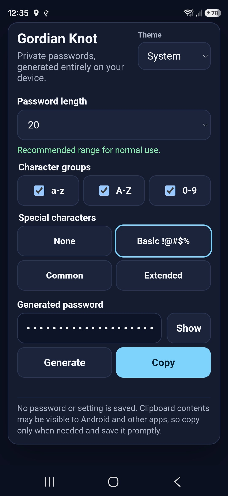

<p align="center">
  
</p>

<h1 align="center">Gordian Knot</h1>

<p align="center">
  A focused, offline password generator for Android.
</p>

Gordian Knot exists for the moments when you need a strong password but do not
want the generator itself to depend on a website, an account, or a network
connection. It is deliberately small: open it, choose the rules, generate a
password, and copy it into the password manager you already trust.

The goal is not to replace a password manager. It is to be a dependable,
standalone tool that remains available offline and does one security-sensitive
job with as little surrounding machinery as possible.

<p align="center">
  
</p>

## Why it is useful

- **Offline by design.** The app has no Internet permission and makes no network
  requests.
- **Security-focused.** Passwords use Web Crypto randomness, rejection sampling
  to avoid modulo bias, and at least one character from every selected group.
- **Minimal.** There are no accounts, analytics, databases, ads, or third-party
  runtime libraries.
- **Private.** Generated passwords are not stored. Android backup, cookies, web
  storage, file access, and WebView navigation are disabled.
- **Practical.** It offers sensible defaults, compatibility lengths, selectable
  character groups, a masked result, sensitive clipboard metadata, and system,
  light, and dark themes.
- **Always at hand.** Once installed, it behaves as a normal Android app and
  works without a browser, server, or connection.

## Security boundaries

Copying necessarily places a password on Android's system clipboard. Gordian
Knot marks that clip as sensitive, but Android, keyboards, or other software may
still be able to observe clipboard contents. Save copied passwords promptly in
a trusted password manager.

Release builds block screenshots and Recent Apps previews. Debug builds allow
screenshots for interface testing and project documentation. The app also
depends on the Android System WebView supplied and updated by the device.

## Install

Download the latest signed APK from the project's **Releases** page. Android may
ask you to allow installation from the browser or file manager used to open it.

## Build from source

Requirements:

- JDK 17 or newer
- Android SDK 36

Android Studio can open the repository directly. To build and lint from the
command line:

```shell
./gradlew lint assembleDebug
```

On Windows PowerShell:

```powershell
.\gradlew.bat lint assembleDebug
```

The debug APK is written to `app/build/outputs/apk/debug/app-debug.apk`.

Run the dependency-free generator tests with Node.js 18 or newer:

```shell
node --test tests/*.test.mjs
```

## Release signing

Debug APKs use Android's development key. Published releases are signed with a
separate project key. Never commit keystores, signing passwords, or a populated
`local.properties` file. Losing the release key prevents future APKs from
upgrading an existing installation.

## Project status

Gordian Knot is intentionally narrow in scope. Features that add accounts,
network access, password storage, or unnecessary dependencies are outside its
mission.

This independent project is not affiliated with or endorsed by Google, Android,
or any password-manager vendor.

## License

[MIT](LICENSE)
